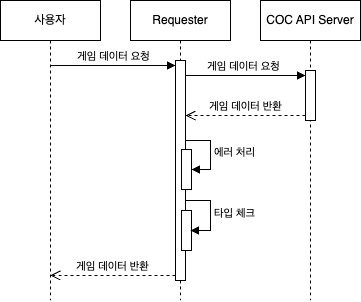
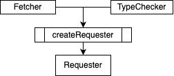

# COC Info

게임 Clash of Clans의 클랜 정보를 제공하는 웹사이트입니다.

개발 기간: 2023년 10월 ~ 11월

배포 링크: https://cocinfo.net/

## 시스템 아키텍처


## 시작

클래시 오브 클랜 API(https://developer.clashofclans.com) 에서 API키를 발급 받습니다.

프로젝트 내의 .env.local.example파일을 토대로 .env.local파일을 생성합니다.

발급받은 API키를 .env.local파일 내 COC_API_KEY에 할당합니다.

```
# .env.local
COC_API_KEY= #coc api key
```

아래의 명령어로 프로젝트를 시작합니다.

```
# 개발 환경
npm run dev
```

```
# 프로덕트 환경
npm run build
npm run start
```

## 고민한 것

### 게임 API 요청 코드 구조 개선

게임 API에 요청을 할 때 에러처리와 응답값에 대한 타입체크를 수행해주어야 합니다.
요청이 필요한 곳 마다 요청, 에러처리, 타입체크 코드를 중복으로 작성하는 것은 매우 비효율적입니다.
[coc-api](https://github.com/coc-info/coc-info/tree/main/src/utils/coc-api) 유틸리티 모듈은 내부적으로 에러처리, 타입체크를 수행하여 사용자가 요청과 응답에만 신경쓸 수 있도록 도와줍니다.



coc-api 내부에서 새로운 요청코드(Request)를 작성할 때 의사결정 시간을 줄이기 위해 요청코드가 특정 절차에 따라 일관된 방법으로 생성될 수 있도록 하였습니다.



Fetcher와 TypeChecker를 인수로 createRequester를 호출하면 Requester가 반환됩니다.
반환된 Requester를 통해 게임 API에 요청을 보냅니다.

- Fetcher: 실질적으로 요청을 보내는 콜백함수
- TypeChecker: 응답으로 받은 데이터의 타입을 검사하는 콜백함수
- Requester: 게임 API에 요청을 보내는 함수

### 컴포넌트 폴더 구조 개선

컴포넌트가 많아지면 다음과 같은 문제가 발생할 수 있습니다.

- 다른 곳에서 재사용해도 문제없이 작동하는 컴포넌트인지 확인하기 어렵습니다.
- 부모,자식 관계를 파악하는데 시간이 걸립니다. 그래서 코드를 수정할 때 코드의 시작점을 찾는데 번거롭고 해당 컴포넌트가 독립적인지 의존적인지 파악하는데 시간이 걸립니다.

이러한 문제를 해결하기 위한 관점으로 컴포넌트와 관련된 폴더의 규칙을 정했습니다.

src/components는 모든 페이지에서 재사용될 수 있는 컴포넌트가 포함됩니다.
각 페이지의 \_components는 해당페이지에서 재사용되지 않는 컴포넌트와 해당페이지와 하위페이지에서 재사용 될 수 있는 컴포넌트가 포함됩니다.

components와 \_components폴더에 포함된 컴포넌트는 폴더로 취급됩니다.
폴더를 컴포넌트 이름으로 명명하고 index.tsx에 코드를 작성합니다. 해당 폴더에 해당 컴포넌트와 관련된 자원과 자식 컴포넌트를 추가할 수 있습니다.
