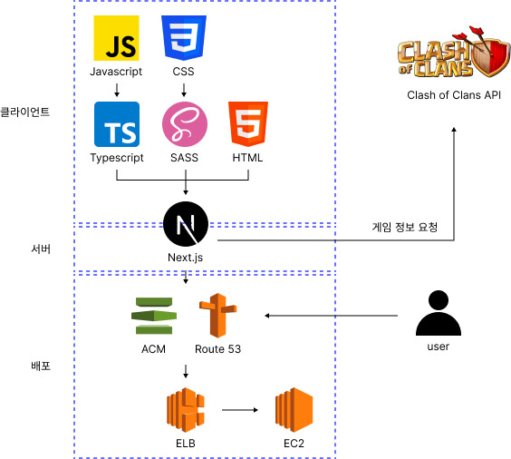

# COC Info

게임 Clash of Clans의 클랜 정보를 제공하는 웹사이트입니다.

개발 기간: 2023년 10월 ~ 11월

배포 링크: https://cocinfo.net/

## 시스템 아키텍처



## 시작

클래시 오브 클랜 API(https://developer.clashofclans.com) 에서 API키를 발급 받습니다.

프로젝트 내의 .env.local.example파일을 토대로 .env.local파일을 생성합니다.

발급받은 API키를 .env.local파일 내 COC_API_KEY에 할당합니다.

```
# .env.local
COC_API_KEY= #coc api key
```

아래의 명령어로 프로젝트를 시작합니다.

```
# 개발 환경
npm run dev
```

```
# 프로덕트 환경
npm run build
npm run start
```

## 고민한 것

### 게임 API 요청 코드 구조 개선

게임 API에 요청을 할 때 에러처리와 응답값에 대한 타입체크를 수행해주어야 합니다.
요청이 필요한 곳 마다 요청, 에러처리, 타입체크 코드를 중복으로 작성하는 것은 매우 비효율적입니다.
[coc-api](https://github.com/coc-info/coc-info/tree/main/src/utils/coc-api) 유틸리티 모듈은 내부적으로 에러처리, 타입체크를 수행하여 사용자가 요청과 응답에만 신경쓸 수 있도록 도와줍니다.


coc-api 내부에서 새로운 요청코드(Request)는 특정 절차에 따라 일관된 방법으로 생성될 수 있도록 하였습니다.


Fetcher와 TypeChecker를 인수로 createRequester를 호출하면 Requester가 반환됩니다.
반환된 Requester를 통해 게임 API에 요청을 보냅니다.

- Fetcher: 실질적으로 요청을 보내는 콜백함수
- TypeChecker: 응답으로 받은 데이터의 타입을 검사하는 콜백함수
- Requester: 게임 API에 요청을 보내는 함수

### 컴포넌트 폴더 구조 개선

많은 수의 컴포넌트를 특정 규칙을 정하여 관리하지 않는다면 다음과 같은 문제가 발생할 수 있습니다.

- 재사용해도 문제없이 작동하는 컴포넌트인지, 재사용가능한 범위가 어느정도인지 확인하기 어렵습니다.
- 컴포넌트간 부모,자식 관계를 파악하기 번거로워 코드의 시작점을 찾기가 힘들고 컴포넌트가 독립적인지 의존적인지 확인하는데 시간이 걸립니다. 그래서 코드를 수정 및 삭제하기가 어렵습니다.

이러한 문제를 해결하고자 다음과 같은 규칙을 정하여 컴포넌트를 관리했습니다.

1. src/components는 모든 페이지에서 재사용할 수 있는 컴포넌트가 포함됩니다.
2. 각 페이지의 \_components는 해당페이지에서 사용하는 재사용을 고려하지 않은 컴포넌트와 해당페이지와 하위페이지에서 재사용 할 수 있는 컴포넌트가 포함됩니다.
3. components와 \_components폴더 내부에서는 이름이 대문자로 시작하는 폴더를 컴포넌트로 취급합니다.
   폴더의 이름은 컴포넌트 이름입니다. 폴더 내부에는 실질적인 컴포넌트 코드가 있는 index.tsx파일이 있어야하고 추가로 컴포넌트와 관련된 자원과 자식 컴포넌트를 포함할 수 있습니다.

다음은 컴포넌트 폴더 구조를 개선하기 전과 후의 예시입니다.

```
-- 개선 전
src/components
├ calcDay.ts
├ Button.tsx
├ UserList.tsx
├ UserInfo.tsx
├ UserItem.tsx
├ Profile.tsx
├ ProfileHeader.tsx
└ ProfileFooter.tsx
```

```
-- 개선 후
src/components
└ Button
  └ index.tsx

src/app/_components
├ UserList
│ ├ index.tsx
│ └ UserItem
│   └ index.tsx
└ Profile
  ├ calcDay.ts
  ├ index.tsx
  ├ Header
  │ └ index.tsx
  ├ Footer
  │ └ index.tsx
  └ UserInfo
    └ index.tsx
```

개선 후 다음과 같은 이점이 생겼습니다.

- 재사용가능한 컴포넌트를 구분하기 쉬워집니다. (예: Button)
- 폴더구조를 통해 컴포넌트의 부모, 자식 관계를 파악할 수 있습니다. (코드를 읽고 파악해야하는 시간이 줄었습니다.) 이를 통해 얻을 수 있는 이점은 다음과 같습니다.
  - 코드의 시작점을 쉽게 찾을 수 있어 코드를 수정하기 용이해집니다.
  - 컴포넌트와 관련된 요소를 문제없이 삭제하기 용이해집니다.
    - 예를 들어 위 예시에서 Profile컴포넌트를 삭제하는 경우<br>
      개선 전에는 Profile.tsx파일 외에 Profile컴포넌트와 관련된 파일인 calcDay.ts, ProfileHeader.tsx, ProfileFooter.tsx은 삭제했을 때 다른 컴포넌트에 영향을 주지 않는지 확인해야합니다.<br>
      개선 후에는 폴더구조를 통해 Profile폴더의 하위요소들은 Profile폴더 내부에서만 사용되는 것을 알 수 있으므로 Profile폴더만 통째로 삭제해주면 됩니다.
